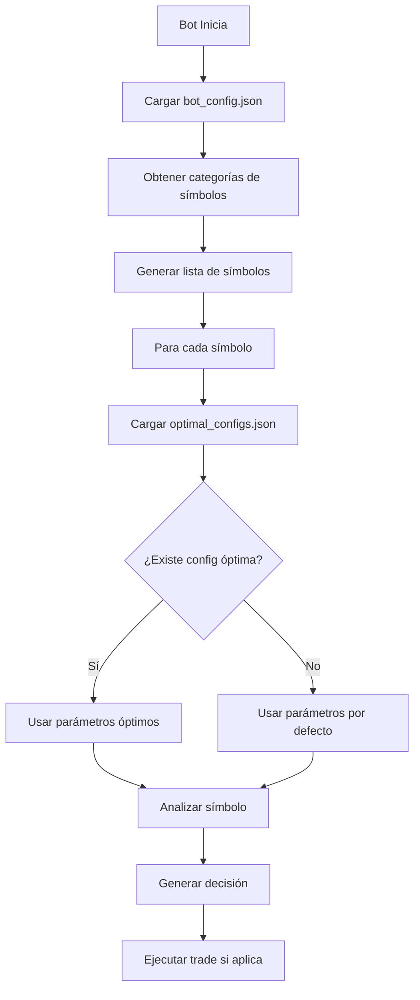

# 🤖 Auto-Configuraciones del Bot - Documentación Completa

## ✅ SÍ, el Bot GUARDA sus Auto-Configuraciones

El bot tiene **DOS sistemas de auto-configuración** que guardan permanentemente:

---

## 📁 Sistema 1: Configuración Dinámica del Bot

### Archivo: `data/bot_config.json`

**Qué guarda**:

```json
{
    "mode": "mock",
    "symbol_categories": ["acciones", "cedears"],
    "max_symbols": 10,
    "risk_per_trade": 2.0
}
```

**Gestor**: [config_manager.py](file:///C:/Users/Lexus/.gemini/antigravity/scratch/fiancial%20de%200/bot2.0/src/utils/config_manager.py)

### Parámetros Guardados

| Parámetro | Descripción | Ejemplo |
|-----------|-------------|---------|
| `mode` | Modo de operación | `"mock"`, `"paper"`, `"live"` |
| `symbol_categories` | Categorías de activos a operar | `["acciones", "cedears"]` |
| `max_symbols` | Número máximo de símbolos | `10` |
| `risk_per_trade` | Riesgo por operación (%) | `2.0` |

### Cómo se Usa en el Bot

```python
# En trading_bot.py líneas 40-62
from src.utils.config_manager import config_manager

# Obtener categorías configuradas
symbol_categories = config_manager.get_symbol_categories()

# Obtener símbolos desde el market manager
all_symbols = market_manager.get_symbols_by_category(symbol_categories)

# Limitar número de símbolos
max_symbols = config_manager.get_max_symbols()
if max_symbols > 0:
    self.symbols = all_symbols[:max_symbols]
```

### Métodos Disponibles

```python
# Leer configuraciones
config_manager.get('key', default_value)
config_manager.get_symbol_categories()
config_manager.get_max_symbols()
config_manager.get_mode()

# Guardar configuraciones
config_manager.set('key', value)
config_manager.set_symbol_categories(['acciones', 'cedears'])
config_manager.set_max_symbols(15)
config_manager.set_mode('paper')

# Actualizar múltiples valores
config_manager.update({
    'symbol_categories': ['acciones'],
    'max_symbols': 20
})
```

---

## 📁 Sistema 2: Configuraciones Óptimas por Símbolo

### Archivo: `data/optimal_configs.json`

**Qué guarda**:

```json
{
    "GGAL": {
        "parameters": {
            "rsi_buy": 28,
            "rsi_sell": 72,
            "sma_period": 45
        },
        "metrics": {
            "return_pct": 25.5,
            "sharpe": 1.8,
            "period": "2024-01-01_to_2024-12-01"
        },
        "updated_at": "2024-12-17T12:00:00",
        "backtest_period": "2024-01-01_to_2024-12-01"
    },
    "YPFD": {
        "parameters": {
            "rsi_buy": 30,
            "rsi_sell": 70,
            "sma_period": 50
        },
        "metrics": {
            "return_pct": 18.3,
            "sharpe": 1.5
        },
        "updated_at": "2024-12-17T11:30:00"
    }
}
```

**Gestor**: [optimal_config.py](file:///C:/Users/Lexus/.gemini/antigravity/scratch/fiancial%20de%200/bot2.0/src/utils/optimal_config.py)

### Parámetros Guardados por Símbolo

- **parameters**: Parámetros técnicos óptimos encontrados
  - `rsi_buy`: Umbral RSI para compra
  - `rsi_sell`: Umbral RSI para venta
  - `sma_period`: Período de media móvil
  - Cualquier otro parámetro optimizado

- **metrics**: Métricas de rendimiento del backtest
  - `return_pct`: Retorno porcentual
  - `sharpe`: Ratio de Sharpe
  - `period`: Período del backtest

- **metadata**: Información adicional
  - `updated_at`: Fecha de última actualización
  - `backtest_period`: Período usado en el backtest

### Cómo se Usa en el Bot

```python
# En trading_bot.py líneas 201-209
from src.utils.optimal_config import optimal_config_manager

# Cargar configuración óptima para un símbolo
optimal_params = optimal_config_manager.get_parameters(symbol, defaults={
    'rsi_buy': 30,
    'rsi_sell': 70,
    'sma_period': 50
})

# Si existe configuración óptima, el bot la usa automáticamente
if optimal_params != defaults:
    log.info(f"✨ Usando configuración óptima para {symbol}: {optimal_params}")

# Generar decisión con parámetros óptimos
decision = self.strategy.generate_decision(df, symbol, rl_prediction, optimal_params)
```

### Métodos Disponibles

```python
# Guardar configuración óptima
optimal_config_manager.save_config(
    symbol="GGAL",
    config={"rsi_buy": 28, "rsi_sell": 72},
    metrics={"return_pct": 25.5, "sharpe": 1.8}
)

# Obtener configuración completa
config = optimal_config_manager.get_config("GGAL")
# Retorna: {'parameters': {...}, 'metrics': {...}, 'updated_at': '...'}

# Obtener solo parámetros (con fallback)
params = optimal_config_manager.get_parameters("GGAL", defaults={...})

# Cargar todas las configuraciones
all_configs = optimal_config_manager.load_all()
```

---

## 🔄 Flujo de Auto-Configuración



---

## 📝 Resumen Ejecutivo

### ¿El bot guarda sus auto-configuraciones?

**✅ SÍ**, el bot guarda **automáticamente**:

1. **Configuración General** (`data/bot_config.json`):
   - Modo de operación
   - Categorías de símbolos seleccionadas
   - Número máximo de símbolos
   - Parámetros de riesgo

2. **Configuraciones Óptimas** (`data/optimal_configs.json`):
   - Parámetros técnicos óptimos por símbolo
   - Métricas de rendimiento
   - Fecha de actualización

### ¿Cómo se guardan?

- **Formato**: JSON con encoding UTF-8
- **Ubicación**: Directorio `data/`
- **Creación**: Automática al iniciar el bot (si no existen)
- **Actualización**:
  - `bot_config.json`: Manual vía `config_manager`
  - `optimal_configs.json`: Automática tras backtesting/optimización

### ¿Cuándo se usan?

- **Al iniciar el bot**: Carga automática de configuraciones
- **En cada análisis**: Usa parámetros óptimos si existen
- **Fallback**: Usa valores por defecto si no hay configuración guardada

---

## 🛠️ Cómo Modificar las Configuraciones

### Opción 1: Programáticamente

```python
from src.utils.config_manager import config_manager
from src.utils.optimal_config import optimal_config_manager

# Cambiar categorías de símbolos
config_manager.set_symbol_categories(['acciones', 'cedears', 'bonos_soberanos'])

# Cambiar número máximo de símbolos
config_manager.set_max_symbols(20)

# Guardar configuración óptima para un símbolo
optimal_config_manager.save_config(
    symbol="GGAL",
    config={"rsi_buy": 25, "rsi_sell": 75},
    metrics={"return_pct": 30.0, "sharpe": 2.0}
)
```

### Opción 2: Editando JSON Directamente

```bash
# Editar configuración general
nano data/bot_config.json

# Editar configuraciones óptimas
nano data/optimal_configs.json
```

### Opción 3: Desde el Dashboard (Futuro)

Actualmente el dashboard (`app.py`) usa `data/app_config.json` separado.
Se puede integrar para que use el mismo `bot_config.json`.

---

## 🎯 Conclusión

El bot **SÍ tiene un sistema robusto de auto-configuración** que:

✅ Guarda configuraciones permanentemente en JSON
✅ Carga automáticamente al iniciar
✅ Usa parámetros óptimos por símbolo si existen
✅ Tiene fallback a valores por defecto
✅ Es fácil de modificar programáticamente o manualmente

**Archivos clave**:

- `data/bot_config.json` - Configuración general del bot
- `data/optimal_configs.json` - Parámetros óptimos por símbolo
- `src/utils/config_manager.py` - Gestor de configuración general
- `src/utils/optimal_config.py` - Gestor de configuraciones óptimas
